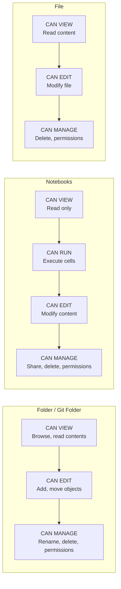
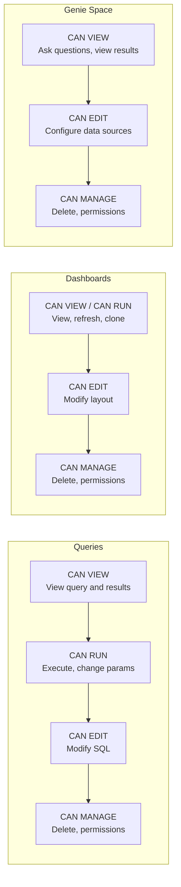
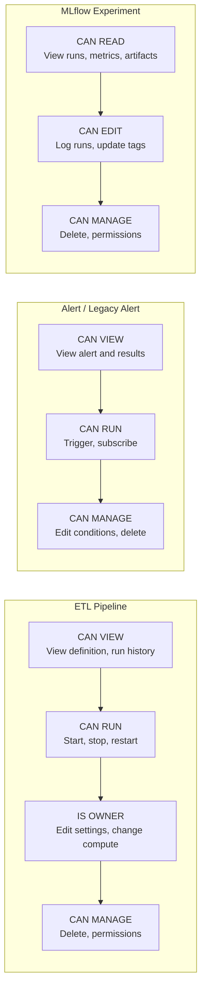
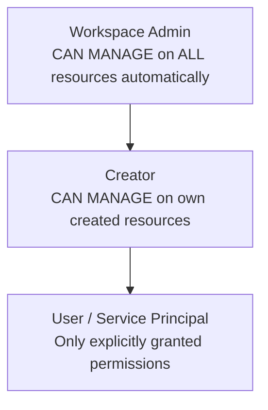

# Databricks Workspace Resources

This document describes all Databricks workspace resources collected by Voyager, the roles and permission levels defined by Databricks, and who can access what across workflows.

---

## Identity Types

| Identity | Description | Max Capacity |
|---|---|---|
| **User** | Human identity identified by email address | 10,000 combined users + service principals per account |
| **Service Principal** | Machine identity for automation, CI/CD, and programmatic access | 10,000 combined users + service principals per account |
| **Group** | Collection of users and service principals for access management | 5,000 per account |

---

## Account-Level Roles

Roles assigned at the Databricks **account** scope. Collected via `AccountClient`.

### Entitlement Roles

| Role | ID | Permissions | Who Can Be Assigned |
|---|---|---|---|
| **Account Admin** | `account_admin` | `account:manage`, `workspace:create`, `workspace:manage`, `user:manage`, `group:manage`, `cloud_resource:manage`, `settings:manage` | Users, Service Principals |
| **Marketplace Admin** | `marketplace_admin` | `marketplace:manage`, `exchange:manage`, `listing:manage` | Users, Service Principals |
| **Billing Admin** | `billing_admin` | `billing:read`, `budget:view`, `budget:create`, `budget_policy:create` | Users, Service Principals |

### Workspace Management Roles

| Role | ID | Permissions | Who Can Be Assigned |
|---|---|---|---|
| **Workspace Creator** | `workspace_creator` | `workspace:create`, `workspace:manage` | Users, Service Principals |
| **Workspace Manager** | `workspace_manager` | `workspace:manage`, `workspace:configure` | Users, Service Principals |

---

## Workspace-Level Roles

Roles assigned at the Databricks **workspace** scope. Collected via `WorkspaceClient`.

### Entitlement Roles

| Role | ID | Permissions | Description |
|---|---|---|---|
| **Admin Access** | `admin_access` | `workspace:manage`, `user:manage`, `group:manage`, `cluster:manage`, `job:manage`, `notebook:manage`, `sql:manage`, `settings:manage` | Full workspace administration — manage identities, ACLs, settings, and features |
| **Workspace Access** | `workspace_access` | `workspace:read`, `cluster:create`, `job:create`, `notebook:create`, `sql:read`, `experiment:create` | Standard user access — create and manage own resources |
| **Databricks SQL Access** | `databricks_sql_access` | `workspace:access`, `sql:access`, `shared_directory:manage` | Default group for all workspace users — grants SQL and workspace access entitlements |
| **Consumer Access** | `consumer_access` | `workspace:manage`, `token:manage`, `cluster:manage`, `job:manage`, `unity_catalog:manage` | Default group for workspace admins — management over tokens, clusters, jobs, and Unity Catalog |

---

## Workspace Resources — Who Can Access What

These are the resources creatable from the Databricks workspace UI. For each resource, permissions are listed from least to most privileged.

### Folder

| Permission | Can Do | Auto-granted To |
|---|---|---|
| `CAN VIEW` | Browse folder, see child objects | — |
| `CAN EDIT` | Add/move objects inside folder | — |
| `CAN MANAGE` | Rename, delete, set permissions | Creator, Workspace Admin |

> Child objects **inherit** all permissions from their parent folder.

### Git Folder

| Permission | Can Do | Auto-granted To |
|---|---|---|
| `CAN VIEW` | Read files, view commit history | — |
| `CAN EDIT` | Pull, commit, push changes | — |
| `CAN MANAGE` | Delete, change remote URL, set permissions | Creator, Workspace Admin |

> Only the **creator** can manage Git credentials. Workspace Admins can manage all Git folders.

### Notebook

| Permission | Can Do | Auto-granted To |
|---|---|---|
| `CAN VIEW` | Read notebook content | — |
| `CAN RUN` | Execute cells, cannot edit | — |
| `CAN EDIT` | Modify notebook content | — |
| `CAN MANAGE` | Share, delete, set permissions | Creator, Workspace Admin |

### File

| Permission | Can Do | Auto-granted To |
|---|---|---|
| `CAN VIEW` | Read file content | — |
| `CAN EDIT` | Modify file | — |
| `CAN MANAGE` | Delete, set permissions | Creator, Workspace Admin |

### Query

| Permission | Can Do | Auto-granted To |
|---|---|---|
| `CAN VIEW` | View query text and results | — |
| `CAN RUN` | Execute query, change parameters | — |
| `CAN EDIT` | Modify query SQL | — |
| `CAN MANAGE` | Delete, set permissions | Creator, Workspace Admin |

> Requires `CAN USE` on a SQL Warehouse to execute.

### Dashboard

| Permission | Can Do | Auto-granted To |
|---|---|---|
| `CAN VIEW` / `CAN RUN` | View results, refresh, clone | — |
| `CAN EDIT` | Modify layout and widgets | — |
| `CAN MANAGE` | Delete, set permissions | Creator, Workspace Admin |

### Genie Space

| Permission | Can Do | Auto-granted To |
|---|---|---|
| `CAN VIEW` | Ask natural language questions, view results | — |
| `CAN EDIT` | Configure data sources and context | — |
| `CAN MANAGE` | Delete, set permissions | Creator, Workspace Admin |

> Underlying table access is still governed by **Unity Catalog** — users only see data they have `SELECT` on.

### ETL Pipeline (Delta Live Tables)

| Permission | Can Do | Auto-granted To |
|---|---|---|
| `CAN VIEW` | View pipeline definition and run history | — |
| `CAN RUN` | Start, stop, and restart pipeline runs | — |
| `IS OWNER` | Edit pipeline settings, change compute | Creator |
| `CAN MANAGE` | Delete, set permissions | Workspace Admin |

> Only `IS OWNER` or `CAN MANAGE` can modify pipeline configuration. One owner only; **cannot be a group**.

### Alert / Legacy Alert

| Permission | Can Do | Auto-granted To |
|---|---|---|
| `CAN VIEW` | See alert, view triggered results | — |
| `CAN RUN` | Manually trigger, subscribe to notifications | — |
| `CAN MANAGE` | Edit conditions, delete, set permissions | Creator, Workspace Admin |

### MLflow Experiment

| Permission | Can Do | Auto-granted To |
|---|---|---|
| `CAN READ` | View runs, metrics, parameters, artifacts | — |
| `CAN EDIT` | Log runs, update metrics and tags | — |
| `CAN MANAGE` | Delete experiment, set permissions | Creator, Workspace Admin |

### Summary Matrix

| Resource | CAN VIEW | CAN RUN / EDIT | CAN MANAGE | IS OWNER |
|---|---|---|---|---|
| Folder | Browse contents | Add/move objects | Delete, permissions | — |
| Git Folder | Read, history | Pull/push commits | Delete, credentials | — |
| Notebook | Read only | Run / Modify | Share, delete | — |
| File | Read only | — / Modify | Delete | — |
| Query | View results | Run / Modify SQL | Delete | — |
| Dashboard | View, clone | — / Modify layout | Delete | — |
| Genie Space | Ask questions | — / Configure | Delete | — |
| ETL Pipeline | View runs | Run / — | Delete | Edit settings |
| Alert | View results | Subscribe / — | Edit, delete | — |
| MLflow Experiment | View runs | — / Log runs | Delete | — |

**Universal rules:**
- **Workspace Admins** get `CAN MANAGE` on all resources automatically
- **Creators** get `CAN MANAGE` on objects they create
- **Groups cannot** hold `IS OWNER` on any resource
- **Service Principals** can hold any permission level the same as users

### Clusters

| Permission | Can Do |
|---|---|
| `CAN ATTACH TO` | Connect notebooks and run commands on the cluster |
| `CAN RESTART` | Restart terminated cluster, run jobs on it |
| `CAN MANAGE` | Full control — configure, delete, modify permissions |

> **Note**: Only `CAN MANAGE` users can view Spark driver logs by default. To allow `CAN ATTACH TO`/`CAN RESTART` users to see logs, a workspace admin must set `spark.databricks.acl.needAdminPermissionToViewLogs = false`.

### Jobs

| Permission | Can Do |
|---|---|
| `CAN VIEW` | View job details, settings, results, Spark UI and logs |
| `CAN MANAGE RUN` | View jobs, trigger immediate runs, cancel runs |
| `IS OWNER` | Edit settings, manage permissions (one owner only; cannot be assigned to groups) |
| `CAN MANAGE` | Full control — edit, delete, modify permissions |

> **Note**: Jobs triggered via "Run Now" run under the **job owner's** permissions, not the triggering user's.

### SQL Warehouses

| Permission | Can Do |
|---|---|
| `CAN VIEW` | View warehouse details |
| `CAN MONITOR` | Monitor performance and status |
| `CAN USE` | Execute queries on the warehouse |
| `IS OWNER` | Warehouse creator — one owner only |
| `CAN MANAGE` | Full administrative control |

---

## Unity Catalog (Metastore-Level)

Unity Catalog provides centralized governance across all workspaces in a region using standard ANSI SQL security.

### Object Hierarchy

### Privilege Inheritance

### Privilege Types by Object

#### Tables & Views

| Privilege | Description |
|---|---|
| `SELECT` | Read table data |
| `MODIFY` | Alter table structure (requires `SELECT` + catalog/schema permissions) |
| `APPLY TAG` | Assign tags to table |
| `MANAGE` | Full control |
| `ALL PRIVILEGES` | All of the above |

#### Schemas

| Privilege | Description |
|---|---|
| `USE SCHEMA` | Access schema |
| `EXTERNAL USE SCHEMA` | External system access to schema |
| `CREATE TABLE` | Create tables |
| `CREATE VIEW` | Create views |
| `CREATE FUNCTION` | Create UDFs |
| `CREATE MODEL` | Create ML models |
| `CREATE VOLUME` | Create volumes |
| `CREATE MATERIALIZED VIEW` | Create materialized views |
| `MANAGE` | Full control |

#### Volumes (Unstructured Data)

| Privilege | Description |
|---|---|
| `READ VOLUME` | Read files from volume |
| `WRITE VOLUME` | Write files to volume |
| `MANAGE` | Full control |

#### Functions & MLflow Models

| Privilege | Description |
|---|---|
| `EXECUTE` | Call / execute function |
| `APPLY TAG` | Tag models |
| `CREATE MODEL VERSION` | Create new model versions |
| `MANAGE` | Full control |

### Who Can Grant Unity Catalog Privileges

> **Inheritance**: Privileges granted at catalog or schema level cascade to all current and future child objects. Metastore-level privileges do **not** inherit downward.

---

## Admin Role Capabilities Summary

| Action | Account Admin | Workspace Admin | Regular User | Service Principal |
|---|---|---|---|---|
| Manage account-level identities | ✓ | — | — | — |
| Assign account-level roles | ✓ | — | — | — |
| Create/manage workspaces | ✓ | — | — | — |
| Add users to workspace | ✓ | ✓ | — | — |
| Assign workspace admin role | ✓ | ✓ | — | — |
| Create objects (notebooks, jobs, clusters) | ✓ | ✓ | ✓ | ✓ |
| `CAN MANAGE` on all workspace objects | ✓ | ✓ (auto) | Only own objects | Only own objects |
| Manage permissions of any object | ✓ | ✓ | Only `CAN MANAGE` objects | Only `CAN MANAGE` objects |
| Create service principal tokens | ✓ | ✓ | — | — |
| View account audit logs | ✓ | — | — | — |
| View workspace audit logs | ✓ | ✓ | — | — |
| Configure compute policies | ✓ | ✓ | — | — |
| Grant Unity Catalog privileges | ✓ | ✓ | If `MANAGE` on object | If `MANAGE` on object |
| Hold `IS OWNER` on objects | ✓ | ✓ | ✓ (own created objects) | ✓ (own created objects) |
| Be assigned `IS OWNER` via API | ✓ | ✓ | ✓ | ✓ |
| Groups can hold `IS OWNER` | — | — | — | — |

---

## Resources Collected by Voyager

### Collection Order

### Full Resource Table

| Priority | Resource | Scope | Status |
|---|---|---|---|
| 0 | Workspaces | Account | Active |
| 1 | Metastores | Account | Active |
| 2 | Users | Account | Active |
| 3 | Groups | Account | Active |
| 4 | Group Memberships | Account | Active |
| 5 | Service Principals | Account | Active |
| 6 | Account Roles | Account | Active |
| 6 | Alerts (V2) | Workspace | Active |
| 6 | Alerts (Legacy) | Workspace | Active |
| 8 | Provider Role Assignments (Users) | Account | Active |
| 9 | Provider Role Assignments (Service Principals) | Account | Active |
| 10 | Personal Access Tokens | Workspace | Active |
| 11 | Service Principal Tokens | Workspace | Active |
| 12 | Workspace Roles | Workspace | Active |
| 14 | Workspace Role Assignments | Workspace | Active |
| — | Clusters | Workspace | Planned |
| — | Jobs | Workspace | Planned |
| — | Workspace Objects | Workspace | Planned |
| — | Unity Catalog Resources | Metastore | Planned |
| — | Metastore Roles | Metastore | Planned |

---

## Sync Schedule

| Workflow | Interval |
|---|---|
| Full inventory refresh | Every 24 hours (default) |
| Workflow timeout | 6 hours |

---

## References

- [Databricks AWS Documentation](https://docs.databricks.com/aws/en/)
- [Access Control Overview](https://docs.databricks.com/aws/en/security/auth/index.html)
- [Unity Catalog Privileges](https://docs.databricks.com/aws/en/data-governance/unity-catalog/manage-privileges/privileges.html)
- [Compute Access Control](https://docs.databricks.com/aws/en/compute/access-control.html)
- [Jobs Access Control](https://docs.databricks.com/aws/en/jobs/access-control.html)
