# Databricks RBAC Relationship Model

This document explains **RBAC relationships across Databricks objects**

---

## Mental Model: Three Independent Security Planes

Databricks access control is **not hierarchical end-to-end**. It is split into three planes with explicit hand-offs.

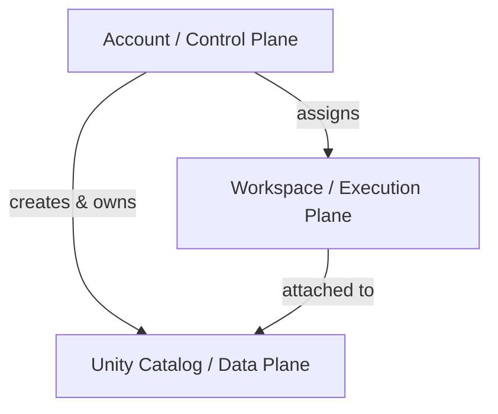

Each plane has **its own admins, permissions, and blast radius**.

---

## 1. Account Plane (Control Plane)

**Purpose:** Governance, identity, billing, and global configuration

### Key Objects
- Account
- Users
- Groups
- Service Principals
- Workspaces
- Metastores

### Account RBAC

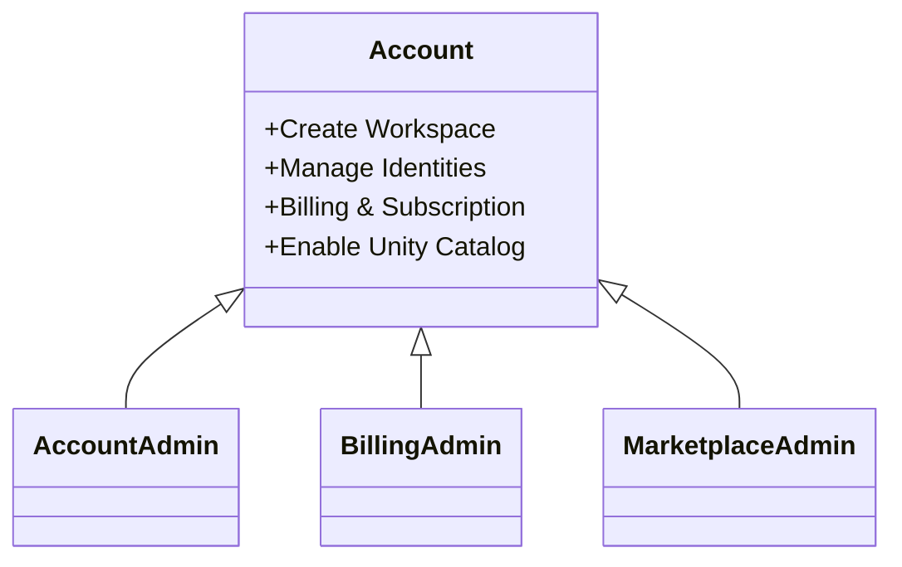

### Important Boundary

> **Account Admin ≠ Workspace Admin ≠ Data Admin**

Being powerful at the account level does **not** grant runtime or data access.

---

## 2. Workspace Plane (Execution Plane)

**Purpose:** Compute, jobs, notebooks, SQL warehouses

### Key Objects
- Workspace
- Clusters
- Jobs
- Notebooks
- SQL Warehouses

### Workspace RBAC

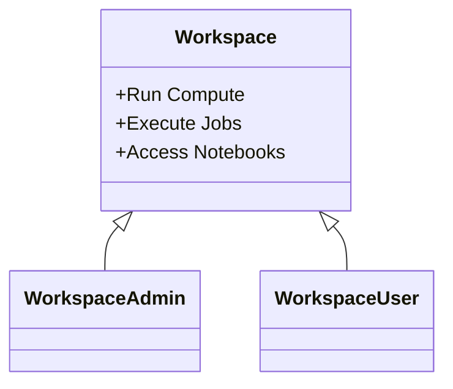

### Workspace Admin Can
- Manage users & groups (workspace-scoped)
- Create/manage clusters & warehouses
- Configure jobs & pipelines

### Workspace Admin Cannot
- Create workspaces
- Manage billing
- Control Unity Catalog permissions (unless explicitly granted)

---

## 3. Unity Catalog Plane (Data Plane)

**Purpose:** Centralized data governance

Unity Catalog is **account-scoped**, not workspace-scoped.

### Key Objects
- Metastore
- Catalog
- Schema
- Table / View / Function

### Object Hierarchy

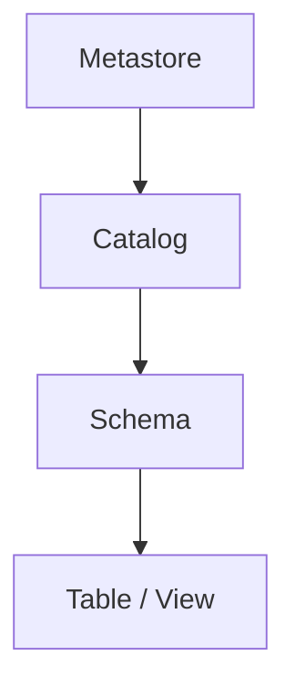

---

## Metastore Admin = Data Root User

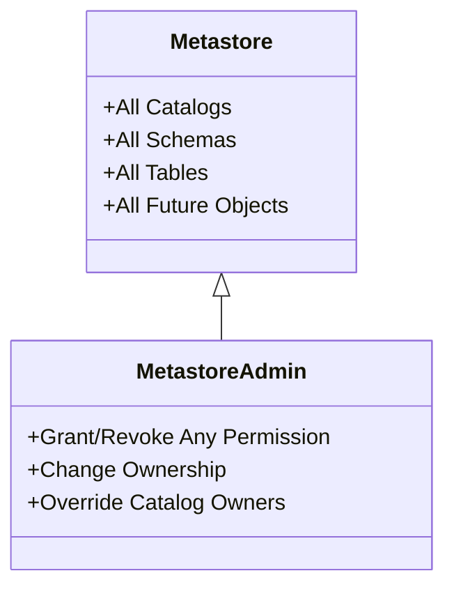

### Critical Rule

> **Metastore Admin has NO implicit workspace, cluster, or job access**

They are *god-mode for data only*.

---

## Cross-Plane Relationship (What Does NOT Propagate)

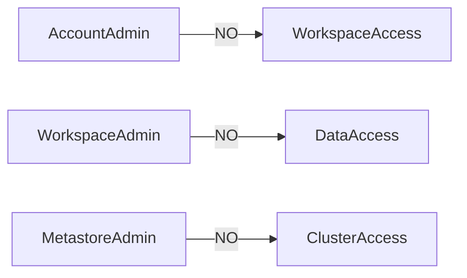

Access must be **explicitly granted in each plane**.

---

## Catalog Creation Rule

By default:
- ❌ Workspace users cannot create catalogs

Allowed only if:

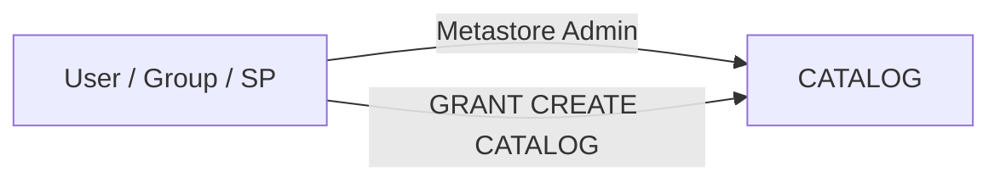

Example:
```sql
GRANT CREATE CATALOG ON METASTORE TO `user_or_group`;
```

---

## Permission Models

### Top-Down (Admin Heavy – Not Recommended)

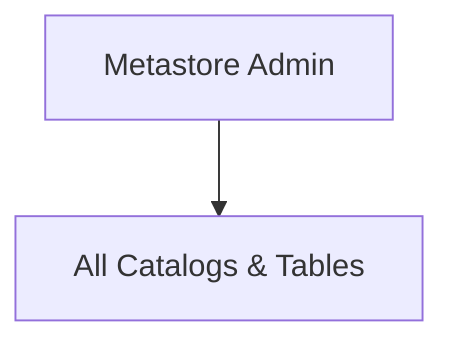

### Bottom-Up (IGA-Friendly – Recommended)

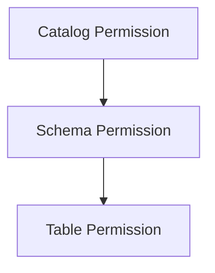

This maps cleanly to:
- Entitlements
- Access reviews
- Least privilege

---

## Example: Account Admin but Workspace User

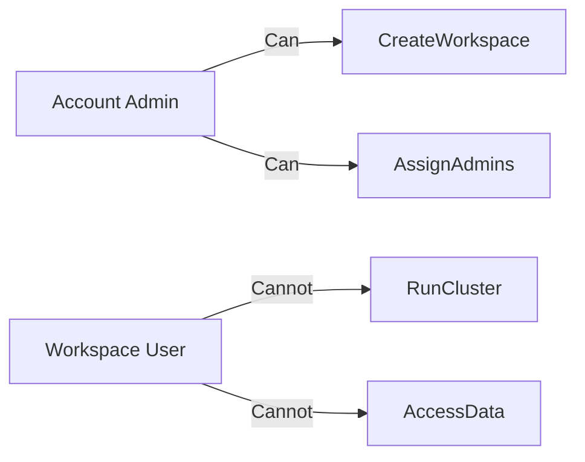

### Result
- Strong governance power
- Zero execution power


## Roles and Permissions Specification (Authoritative Reference)

This section formally specifies **roles vs permissions vs grants** in Databricks so RBAC decisions are unambiguous and auditable.

---

## Core RBAC Vocabulary (Databricks-Specific)

| Term | Meaning in Databricks | Scope |
|----|----|----|
| Identity | User / Group / Service Principal | Account |
| Role | High-level authority | Account |
| Permission | Action on an object | Object-specific |
| Grant | Assignment of permission | Explicit |
| Ownership | Delegated admin on object | Object-specific |

---

## Account-Level Roles

Account roles control **governance**, not execution or data access.

| Role | Who Can Have It | Capabilities |
|----|----|----|
| Account Admin | User, Group, SP | Manage workspaces, identities, metastores, billing config |
| Billing Admin | User, Group, SP | View/manage billing only |
| Marketplace Admin | User, Group, SP | Marketplace assets only |

⚠️ Account roles do **not** grant:
- Workspace access
- Cluster access
- Job access
- Unity Catalog access

---

## Workspace-Level Roles

| Role | Applies To | Capabilities |
|----|----|----|
| Workspace Admin | User, Group | Full workspace control |
| Workspace User | User, Group | Use only what is granted |

Workspace roles do **not** grant data access.

---

## Service Principal Permissions

Service Principals do **not use roles** for execution. They use **permissions**.

| Permission | Meaning | Typical Assignees |
|----|----|----|
| USE | Allows workloads to run as SP | Jobs, DLT, CI/CD |
| MANAGE | Full admin over SP (rotate secrets, delete) | Platform admins |

### Permission Semantics

| Combination | Result |
|----|----|
| USE only | Can execute workloads as SP |
| MANAGE only | Can administer SP, cannot run workloads |
| USE + MANAGE | Full control |
| Neither | No access |

MANAGE does **not** imply USE.

---

## Unity Catalog Permissions (Data Plane)

| Level | Permissions |
|----|----|
| Metastore | CREATE CATALOG, CREATE EXTERNAL LOCATION |
| Catalog | USE CATALOG, CREATE SCHEMA |
| Schema | USE SCHEMA, CREATE TABLE |
| Table/View | SELECT, MODIFY |

Permissions are **explicit and allow-only**.

---

## Ownership vs Admin vs Permission

| Capability | Owner | Admin | Permission Holder |
|----|----|----|----|
| Grant access | ✅ | ✅ | ❌ |
| Change owner | ❌ | ✅ | ❌ |
| Access object | ✅ | ❌ | ✅ |

Admins can override owners.

---

## Who Can Grant What (Control Boundaries)

| Action | Required Authority |
|----|----|
| Create User / Group / SP | Account Admin |
| Assign Account Role | Account Admin |
| Grant SP USE / MANAGE | Account Admin |
| Add SP to Workspace | Workspace Admin |
| Grant UC Permissions | Metastore Admin / Owner |
| Assign Workspace Role | Workspace Admin |

---

## Role–Permission Non-Propagation Rules

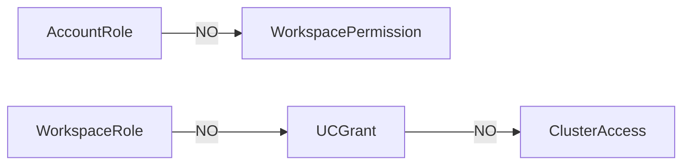

Every plane requires **explicit grants**.

---

## Final Takeaway

- Roles define **authority**, not access
- Permissions define **actions on objects**
- Grants are always explicit
- No role automatically crosses planes

This specification should be treated as the **source of truth** for RBAC decisions.

---

These examples close the gap between theory and audits
