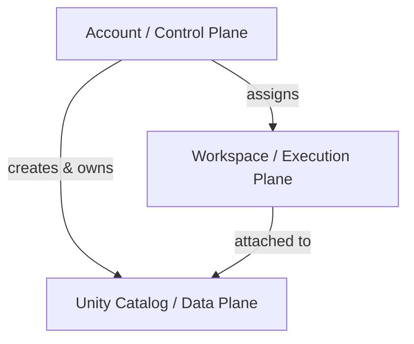
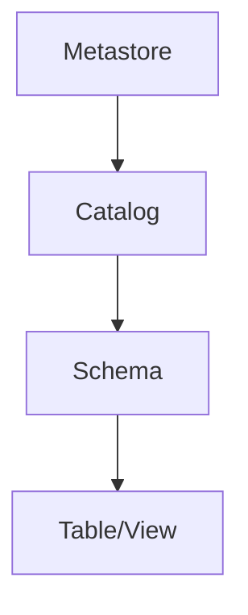
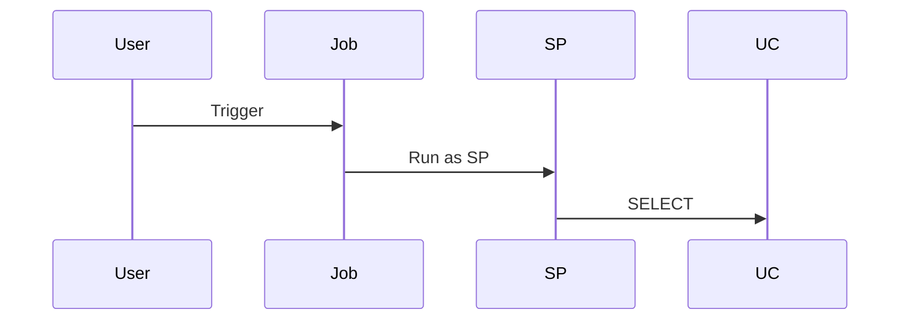

# Databricks RBAC Relationship Model

This document explains **RBAC relationships across Databricks objects** based on real platform behavior.
It is suitable for **GitHub**, **architecture reviews**, and **IGA / PAM design**.

---

## Mental Model: Three Independent Security Planes



---

## Account Plane (Control Plane)

### Account Roles
| Role | Scope | Notes |
|----|----|----|
| Account Admin | Account | Governance only |
| Billing Admin | Account | Billing visibility |
| Marketplace Admin | Account | Marketplace control |

Account roles **do not grant workspace or data access**.

---

## Workspace Plane (Execution Plane)

| Role | Capabilities |
|----|----|
| Workspace Admin | Full workspace control |
| Workspace User | Explicitly granted access only |

Workspace roles **do not grant data access**.

---

## Unity Catalog (Data Plane)



### Metastore Admin
- Full data governance
- No implicit workspace or compute access

---

## Service Principal Permissions

| Permission | Meaning |
|----|----|
| USE | Allows workloads to run as SP |
| MANAGE | Administer SP (rotate secrets, delete) |

MANAGE **does not imply** USE.

---

## Roles vs Permissions vs Grants

| Concept | Meaning |
|----|----|
| Role | Authority |
| Permission | Action |
| Grant | Assignment |
| Ownership | Delegated admin |

---

## RBAC Combination Examples

### Job Runs Without User Data Access


User cannot access data directly.

---

### Schema Creation Without Catalog Creation
```sql
GRANT CREATE SCHEMA ON CATALOG sales TO data_engineers;
```

---

### External Location Missing Permission
User has SELECT on table but no external location permission → query fails.

---

## Key Takeaways
- RBAC is **plane-scoped**
- No implicit propagation
- Allow-only model
- Least privilege via bottom-up grants
